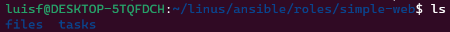
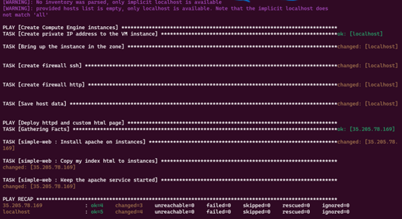

# ANSIBLE Y TERRAFORM
En la siguiente práctica se utilizarán tanto ansible como terraform para hacer aprovisionamiento de infraestructura. Se comenzará lanzando una VM a través de ansible, y se continuará con terraform creando un template.

# Ansible
## Service Account
Para comenzar es necesario crear una service account, necesaria por temas de autenticación, y cederle ciertos permisos para que pueda interactuar con nuestro proyecto.


Tras esto, es necesario asociar una clave ssh a la service account. Observando la configuración del proyecto por consola se puede observar que la service account tiene acceso. Para terminar se determinan la región y zona por defecto a través de la consola de gcloud.


## Ansible Playbook
En este apartado es necesario tener una estructura interna de archivos para tener un correcto funcionamiento




El playbook que se muestr a continuación es el código equivalente para montar la vm, e instalarla, configurando sus firewalls y demás parámetros
main.yaml: 
```yaml
# ansible notebook, to configure the VMs on GCP
- name: Create Compute Engine instances
  hosts: localhost
  gather_facts: no
  vars:
      gcp_project: asr-pract-3 #Setear vuestro proyecto
      gcp_cred_kind: serviceaccount
      gcp_cred_file: "/home/luisf/linus/ansible/asr-pract-3-28066a49033c.json" #Aqui setear con la ruta de vuestra SA
      region: "europe-west1"
      zone: "europe-west1-d"
      machine_type: "n1-standard-1"
      image: "projects/centos-cloud/global/images/centos-7-v20230912"

  tasks:
   - name: Create private IP address to the VM instance
     gcp_compute_address:
       name: "maquina-prueba-ip"
       region: "{{ region }}"
       project: "{{ gcp_project }}"
       service_account_file: "{{ gcp_cred_file }}"
       auth_kind: "{{ gcp_cred_kind }}"
     register: gce_ip
   - name: Bring up the instance in the zone
     gcp_compute_instance:
       name: "maquina-prueba"
       machine_type: "{{ machine_type }}"
       disks:
         - auto_delete: true
           boot: true
           initialize_params:
             source_image: "{{ image }}"
       network_interfaces:
         - access_configs:
             - name: External NAT  # public IP
               nat_ip: "{{ gce_ip }}"
               type: ONE_TO_ONE_NAT
       tags:
         items: 
           - http-server
           - https-server
           - ssh-externo

       zone: "{{ zone }}"
       project: "{{ gcp_project }}"
       service_account_file: "{{ gcp_cred_file }}"
       auth_kind: "{{ gcp_cred_kind }}"
     register: gce 
   - name: create firewall ssh
     google.cloud.gcp_compute_firewall:
       name: ssh-firewall
       allowed:
       - ip_protocol: tcp
         ports:
         - '22'
       target_tags:
       - ssh-externo
       source_ranges:
       - 81.34.9.236/32
       - 130.206.68.4/32
       project: "{{ gcp_project }}"
       service_account_file: "{{ gcp_cred_file }}"
       auth_kind: "{{ gcp_cred_kind }}"
       state: present
   - name: create firewall http
     google.cloud.gcp_compute_firewall:
       name: http-firewall
       allowed:
       - ip_protocol: tcp
         ports:
         - '80'
       target_tags:
       - http-server
       source_ranges:
       - 81.34.9.236/32
       - 130.206.68.4/32
       project: "{{ gcp_project }}"
       service_account_file: "{{ gcp_cred_file }}"
       auth_kind: "{{ gcp_cred_kind }}"
       state: present
 
  post_tasks:
    - name: Save host data
      add_host:
        hostname: "{{ gce_ip.address }}"
        groups: gce_instances_ips

- name: Deploy httpd and custom html page 
  hosts: gce_instances_ips
  become: yes   # to run as root
  become_method: sudo
  roles:
    - simple-web
```
Para el firewall se instalan dos: uno para ssh y otro para http, indicando las ips de fuente en source_ranges, y los tags a los que se aplica el firewall con target_tags (los tags se definen antes en el documento, en "Bring up the instance in the zone")
```yaml
- name: create firewall ssh
     google.cloud.gcp_compute_firewall:
       name: ssh-firewall
       allowed:
       - ip_protocol: tcp
         ports:
         - '22'
       target_tags:
       - ssh-externo
       source_ranges:
       - 81.34.9.236/32
       - 130.206.68.4/32
       project: "{{ gcp_project }}"
       service_account_file: "{{ gcp_cred_file }}"
       auth_kind: "{{ gcp_cred_kind }}"
       state: present
   - name: create firewall http
     google.cloud.gcp_compute_firewall:
       name: http-firewall
       allowed:
       - ip_protocol: tcp
         ports:
         - '80'
       target_tags:
       - http-server
       source_ranges:
       - 81.34.9.236/32
       - 130.206.68.4/32
       project: "{{ gcp_project }}"
       service_account_file: "{{ gcp_cred_file }}"
       auth_kind: "{{ gcp_cred_kind }}"
       state: present
```
Para terminar, se incluyendo dos archivos más, un index.html para la página web a la que vamos a acceder (se verá en el resultado final), y otro playbook main.yml donde se instala httpd y se aloja nuestro sitio web en la VM.

## Ejecución
Como paso final, se ejectuta el playbook mediante el comando
```bash
ansible-playbook main.yml -u sa_<UID de la SA>
```


y se comprueba que la vm ha sido creada, con sus consecuentes firewall rules:


y finalmente se accede a la ip asignada (se observa en gcloud accediendo a nuestra vm).


# Terraform
En este apartado se procederá a crear un fichero de configuración terraform, donde crearemos la máquina virtual, aplicando la misma mediante la línea de comandos.

## Fichero configuración
El fichero de configuración es el siguiente:

```terraform
provider "google" {
  credentials = "/home/luisf/linus/ansible/asr-pract-3-28066a49033c.json"
  project = "asr-pract-3"
  region  = "europe-west1"
  zone    = "europe-west1-d"
}

resource "google_compute_instance" "terraform" {
  name         = "terraform"
  machine_type = "n1-standard-1"
  boot_disk {
    initialize_params {
      image = "projects/centos-cloud/global/images/centos-7-v20220822"
    }
  }
  network_interface {
    network = "default"
    access_config {
    }
  }
}

resource "google_compute_firewall" "rules-1" {
  project     = "asr-pract-3"
  name        = "ssh-firewall-terraform"
  network     = "default"
  description = "Creates ssh firewall rule"

  allow {
    protocol  = "tcp"
    ports     = ["22"]
  }
  
  source_ranges = ["81.34.9.236/32", "130.206.68.4/32"]
  target_tags = ["ssh-externo"]
}

resource "google_compute_firewall" "rules-2" {
  project     = "asr-pract-3"
  name        = "http-firewall-terraform"
  network     = "default"
  description = "Creates http firewall rule"

  allow {
    protocol  = "tcp"
    ports     = ["80"]
  }
  
  source_ranges = ["81.34.9.236/32", "130.206.68.4/32"]
  target_tags = ["http-server"]
}
```
Se puede observar que el fihero sigue la misma configuración que hemos generado anteriormente en el playbook de ansible, generando las dos reglas de firewall necesarias para tráfico ssh y http. Cabe destacar que para tener correcto acceso al proyecto, es necesario provisionar los credenciales de la service account, es decir el json. Esto se realiza al principio del documento en el apartado credentials.

```terraform
resource "google_compute_firewall" "rules-1" {
  project     = "asr-pract-3"
  name        = "ssh-firewall-terraform"
  network     = "default"
  description = "Creates ssh firewall rule"

  allow {
    protocol  = "tcp"
    ports     = ["22"]
  }
  
  source_ranges = ["81.34.9.236/32", "130.206.68.4/32"]
  target_tags = ["ssh-externo"]
}

resource "google_compute_firewall" "rules-2" {
  project     = "asr-pract-3"
  name        = "http-firewall-terraform"
  network     = "default"
  description = "Creates http firewall rule"

  allow {
    protocol  = "tcp"
    ports     = ["80"]
  }
  
  source_ranges = ["81.34.9.236/32", "130.206.68.4/32"]
  target_tags = ["http-server"]
}
```
## Resultados terraform
### Terraform plan y terraform apply
A continuación se mostrarán los resultados de los comandos por consola de terraform plan y apply, y los ficheros de estado que se guardan en local.


### Resultado final terraform
Tras esto, si se accede al gui de gcloud podemos ver que se han creado tanto la VM como las firewall rules descritas en el fichero de configuración.


